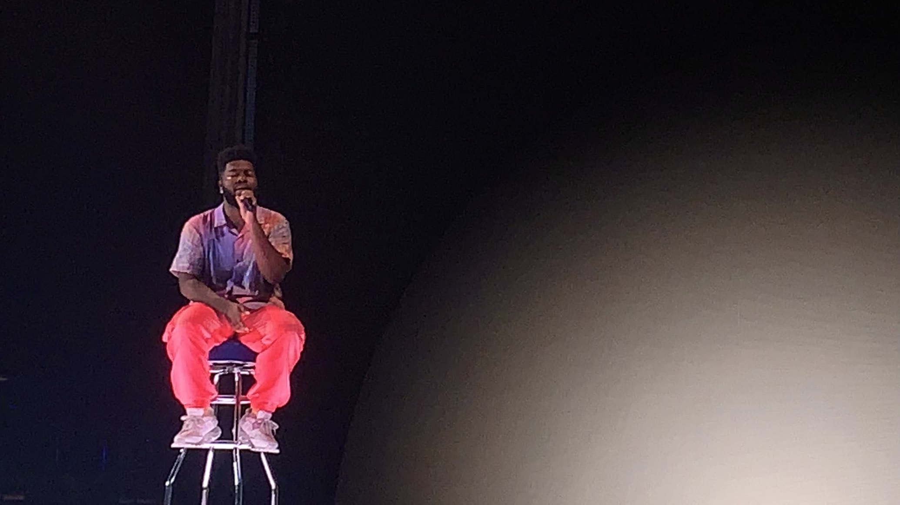
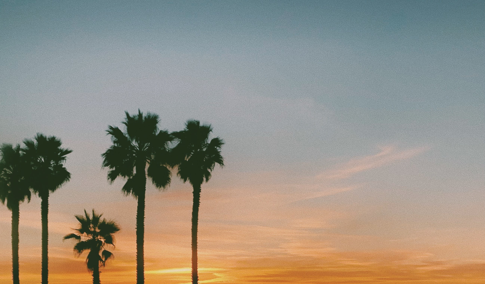

#  Sonika Ram's User Page

## Who Am I?
Hi! My name is Sonika and I am a second year computer science student at UCSD. I have experience with mainly Java, C, and C++. I am currently learning Javascript and HTML/CSS, and I love it so far. In my free time, I love to bake, watch the sunset, and get coffee! My favorite tv show at the moment is Criminal Minds, and I *love* to discover new music.

## My Links!
[LinkedIn](https://www.linkedin.com/in/sonika-ram-451376199/)
| [Spotify](https://open.spotify.com/user/1kjn9ys0nhgj5ivrhkdjc5j4k?si=y7oYAtC2Sc6D6qz3JmxKvw)

## My Favorite Quotes. 
Mother Teresa once said,
> Spread love everywhere you go. Let no one ever come to you without leaving happier. 

## 3 things I want to accomplish Spring Quarter
- Go outside and get fresh air once a day
- Work hard in my classes and try not to procrastinate
- Learn how to cook healthy meals

## Top 3 favorite places in San Diego
1. Solana Beach
2. Seaport Villiage
3. Sunset Cliffs

## Week 1 Tasks:
- [x] Complete Lab 1   
- [x] Complete Survey  
- [ ] Complete Individual Engineer Statement

## Things I love.

## Reminder: 
If you make a change to this user page, remember to use the commands `git add`, `git commit`, and `git push`. 

###### Link to the README file:
###### [README for this project](README.md)

 

[GO TO TOP](#sonika-rams-user-page)

